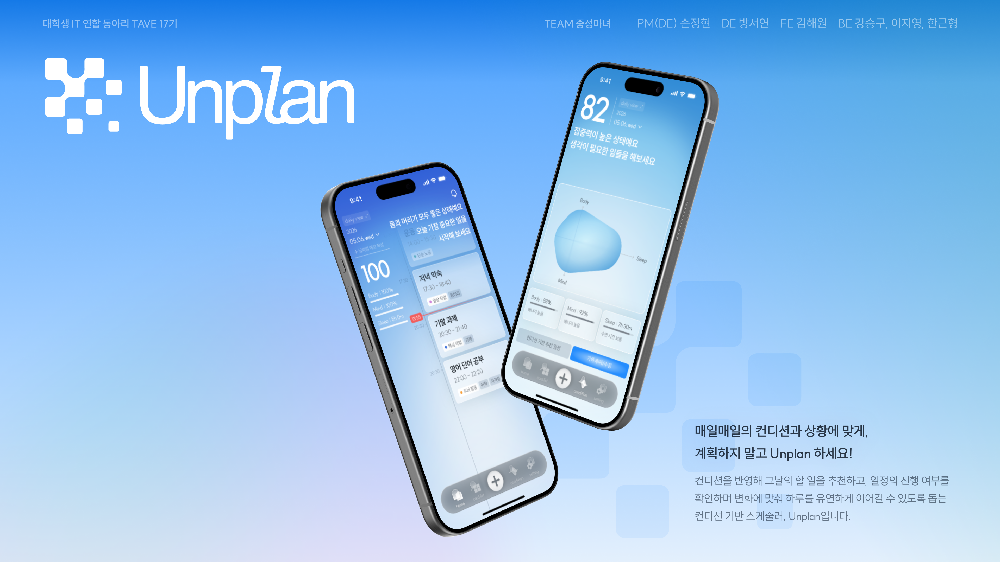

<p align="center">
  
</p>

<h1 align="center">Unplan</h1>

<p align="center">
  매일의 컨디션과 상황에 맞춰,<br />
  계획하지 말고 Unplan 하세요.
</p>

<p align="center">
  <a href="#주요-기능">주요 기능</a>
  ·
  <a href="#기술-스택">기술 스택</a>
  ·
  <a href="#시작하기">시작하기</a>
  ·
  <a href="#testflight-베타-테스터">TestFlight</a>
</p>

## 소개

**Unplan**은 사용자의 컨디션과 생활 패턴을 바탕으로
그날의 일정을 유연하게 관리할 수 있도록 돕는 스마트 스케줄러입니다.

계획을 빽빽하게 채우는 것보다, 오늘의 상태에 맞춰 할 일을 조정하고
하루를 이어갈 수 있는 경험을 만듭니다.

## 주요 기능

### 소셜 로그인

- 카카오 로그인
- 구글 로그인
- `expo-secure-store`를 활용한 인증 세션 안전 저장

### 온보딩

- 회복 방법, 목표 수면 시간, 활동 시간대, 이동 수단 등 생활 패턴 입력
- 입력한 온보딩 정보 서버 저장
- 로그인 및 온보딩 완료 여부에 따른 앱 진입 경로 분기

### 일정 관리

- 일별, 주별, 월별 일정 조회 API 연동 구조
- 일정 생성, 수정, 삭제 API 연동 구조
- OpenAPI 기반 코드 생성을 통한 API 타입 안전성 확보

### 앱 경험

- Expo Router 기반 파일 라우팅
- 디자인 토큰과 공통 UI 컴포넌트를 활용한 일관된 인터페이스
- EAS Update를 활용한 OTA 업데이트 지원

## 기술 스택

| 분야 | 기술 |
| --- | --- |
| Framework | Expo SDK 56, React Native, React 19 |
| Language | TypeScript |
| Navigation | Expo Router |
| Server State | TanStack Query |
| Client State | Zustand, Immer |
| API | Axios, Orval |
| Authentication | Kakao Login, Google Sign-In |
| Storage | expo-secure-store, react-native-mmkv |
| Styling | StyleSheet, Design Tokens |
| Deployment | EAS Build, EAS Update |

## 프로젝트 구조

```text
src/
├── app/          # Expo Router route 및 layout
├── screens/      # 화면 단위 구현
├── components/
│   ├── ui/       # 공통 UI primitive
│   ├── domain/   # 도메인 표현 컴포넌트
│   └── features/ # 화면·플로우 전용 컴포넌트
├── domains/      # 도메인 모델, API, 상태, 순수 로직
├── hooks/        # 앱 전역 hook
├── lib/          # API, 저장소, SDK 등 인프라
└── constants/    # 디자인 토큰 및 앱 상수
```

## 시작하기

### 요구 사항

- Node.js
- npm
- iOS 개발 시 Xcode 및 CocoaPods
- Android 개발 시 Android Studio

### 설치

```bash
npm install
```

### 실행

```bash
npm run start
```

iOS 시뮬레이터에서 실행합니다.

```bash
npm run ios
```

Android 에뮬레이터에서 실행합니다.

```bash
npm run android
```

## 환경 변수

프로젝트 루트에 `.env.local` 파일을 만들고 필요한 값을 입력합니다.

```env
EXPO_PUBLIC_API_URL=
EXPO_PUBLIC_KAKAO_NATIVE_APP_KEY=
EXPO_PUBLIC_GOOGLE_WEB_CLIENT_ID=
EXPO_PUBLIC_GOOGLE_IOS_CLIENT_ID=
EXPO_PUBLIC_GOOGLE_IOS_URL_SCHEME=
OPENAPI_SPEC_URL=
```

> 민감한 환경 변수는 저장소에 커밋하지 않습니다.

## 코드 품질 확인

```bash
npm run check
```

## TestFlight 베타 테스터

iOS 베타 테스트에 참여하고 싶다면 아래 메일로 문의해 주세요.

[khcw1029@daum.net](mailto:khcw1029@daum.net)

## Frontend

| 역할 | 담당 |
| --- | --- |
| Frontend | 김해원 |

---

## 개발 문서

아키텍처·컨벤션·구현 현황은 [overview.md](./overview.md)에서 확인할 수 있습니다.
